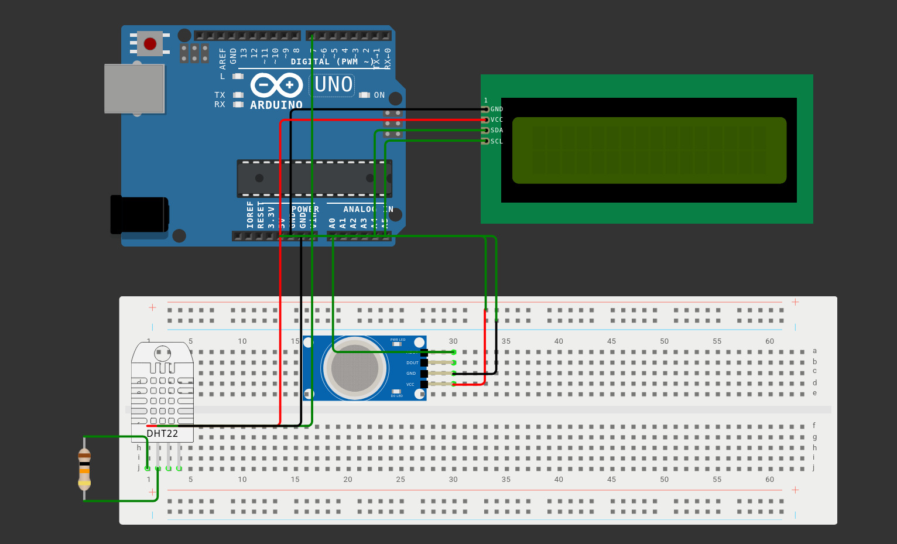

# Baby Sleep Monitor (Arduino)

## Overview
This project monitors a baby's environment using multiple sensors and alerts caregivers when conditions go out of range.

## Features
- Temperature & Humidity monitoring (DHT22)
- Air Quality detection (MQ135)
- Sound detection (cry/noise detection)
- LCD display output
- Buzzer alerts for unsafe conditions

## Components Used
- Arduino
- DHT22 Sensor
- MQ135 Gas Sensor
- Sound Sensor
- I2C LCD Display (16x2)
- Buzzer

## Working
The system continuously checks:
- Temperature (18°C – 22°C safe range)
- Humidity (40% – 55%)
- Air quality levels
- Sound intensity (baby crying detection)

If any value goes out of range:
- Warning is displayed on LCD
- Buzzer alert is triggered

## Circuit Diagram

## How to Run
1. Connect all sensors to Arduino
2. Upload `sleep_monitor.ino`
3. Power the system
4. Monitor readings on LCD
